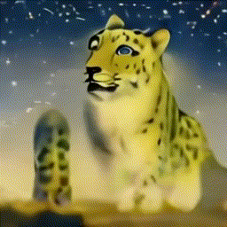
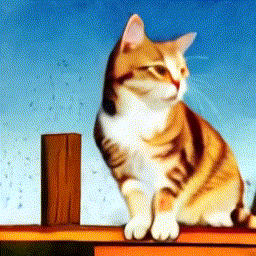
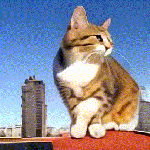
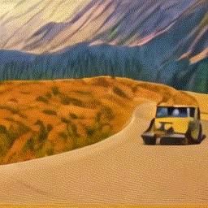
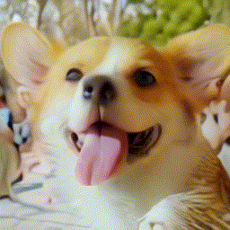
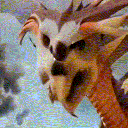
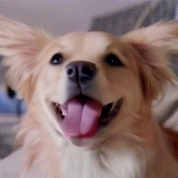
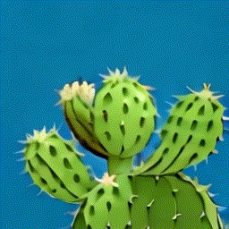
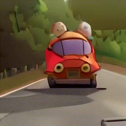

# *MotionAlchemy:* Text-Driven Image-to-Video Synthesis
**EN:** *MotionAlchemy:* Text-Driven Image-to-Video Synthesis explores the challenging task of generating dynamic video sequences from a single image and text description. The core focus is on multimodal fusion, where the model transforms natural language input into spatially and temporally consistent video output. By leveraging a Flow modell, the proposed method enables robust frame-by-frame synthesis. Key innovations include a novel multi-stage conditioning technique to ensure coherent temporal dynamics and precise spatial details. Despite progress, significant challenges remain, including ensuring accurate cross-modal alignment between abstract text descriptions and concrete video outputs, meeting the computational demands of long video generation, and maintaining continuity across frames. The method excels in synthesizing realistic videos with high temporal fidelity, pushing the boundaries of text-driven video generation.

**CN:** *MotionAlchemy:* 文本驱动的图像到视频合成探索了从单个图像和文本描述生成动态视频序列的挑战性任务。核心重点是多模态融合，其中模型将自然语言输入转换为空间和时间一致的视频输出。通过利用整流模型，所提出的方法可以实现稳健的逐帧合成。关键创新包括一种新颖的多阶段调节技术，以确保连贯的时间动态和精确的空间细节。尽管取得了进展，但仍存在重大挑战，包括确保抽象文本描述和具体视频输出之间的准确跨模态对齐、满足长视频生成的计算需求以及保持跨帧的连续性。该方法在合成具有高时间保真度的逼真视频方面表现出色，突破了文本驱动图像进行视频生成的界限。

[English](./README.md) | [简体中文](./README_cn.md)

# 视频编辑任务
任务简述：根据文本指令对原始视频进行定向修改和优化处理。主要包括风格迁移(将视频画面转换为特定艺术风格)、主体替换(替换视频中的特定对象或人物)等常见编辑需求。模型需严格按照需求说明进行相应的视频处理,确保最终效果符合预期。
## Demos 2s $\times$ 256 $\times$ 256
| 原始视频 | 提示词 | 修改后的视频 **2s 256×256** |
|----------|--------|---------------------------|
|  | A snow leopard with vibrant green eyes sitting on an icy mountain peak, with snowflakes gently falling around. | |
||A grey tabby cat sitting on a wooden platform with a blue sky in the background, painted in watercolor style.| |
||A grey tabby cat sitting on a city rooftop with skyscrapers in the distance.| |
| | A vehicle traversing a serpentine mountain road, rendered in the vibrant and textured style of a Van Gogh painting.| |
| | A playful corgi dog with its mouth open and tongue out, standing in a sunny park with children playing in the background.| |
| | A fantasy dragon with fiery eyes and smoke coming out of its nostrils, perched on top of a rocky cliff, thunderstorm behind| |
| | A playful golden retriever with its mouth open and tongue out, looking excitedly at the camera.| |
| | A cactus with a yellow flower against a blue background blooms, Fairy Tale Animation style.| |
| | Animated characters enjoying a road trip in a cartoonish red spaceship on a country road.| |

# 动作定制任务
任务简述：任务简述：动作定制是指基于输入的图像,根据提示词要求生成连贯流畅的动作序列。在处理过程中需确保人物形象保持高度还原,动作自然流畅,且避免任何形态畸变。整个动作过程应当连贯一致,展现出专业水准。

# 多视角图像合成视频
任务简述：多视角图像合成视频是指将同一目标的多个不同角度的图像作为输入,通过先进的图像处理技术,生成目标对象从一个视角平滑过渡到另一个视角的连续视频序列。这一过程需确保视角转换自然流畅,图像细节保真度高,且过渡期间不出现画面撕裂或变形等问题。

## ToDo
- [x] 视频编辑功能
- [ ] 支持更长视频序列的生成（>2s）
- [ ] 优化多视角合成的细节还原度
- [ ] 提升动作定制任务的精确控制
- [ ] 优化模型推理速度
- [ ] 发布预训练模型
- [ ] 补充详细的API文档

## 项目发起
本项目由宜宾学院计算机科学与技术学院(人工智能学院)机器视觉小组实验室发起，为探索文本驱动的图像-视频生成和编辑技术，推动多模态融合在视频合成领域的应用，促进人工智能视觉创作以及具身智能的发展。

## 致谢
我们由衷的感谢以下工作的无私开源
- [open-sora](https://github.com/hpcaitech/Open-Sora/): A powerful and complete text-generated video model
- [ColossalAI](https://github.com/hpcaitech/ColossalAI): A powerful large model parallel acceleration and optimization
- [PixArt](https://github.com/PixArt-alpha/PixArt-alpha): An open-source DiT-based text-to-image model.
- [Latte](https://github.com/Vchitect/Latte): An attempt to efficiently train DiT for video.
- [LAMP](https://github.com/RQ-Wu/LAMP): LAMP is a few-shot-based method for text-to-video generation.
- [CCEdit](https://github.com/RuoyuFeng/CCEdit):A powerful model for creative and controllable video editing using diffusion models, and a video modification dataset released

